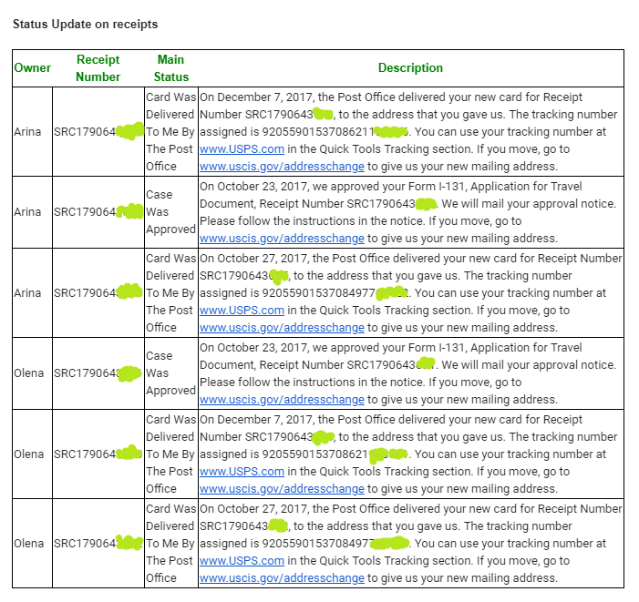

## The reason
I always been curious and want to know news ASAP. That was the case and with my family Green Card status. 
After checking the cases three days in a raw I decided to write a little app that would deliver this updated information 
on day-to-day basis to me and my husband via email. It helped utilize time in a better way, allowing us avoid repeating actions for 9 receipts.
I hope this code will be useful and for naturalization reason. =)

## How to set up

### App configuration
[app.properties](https://github.com/sheva/check-case-status/blob/master/src/main/resources/app.properties) file.
1. List case numbers that you are interested in (< person >|< receipt number > using ";" delimiter)
```
receipt.numbers=Vasya|SRC1790643123;Vasya|SRC1790643124;Vasya|SRC1790643125;Goga|SRC1790643126
```
2. Define frequency of case status check (in hours).
```
check.period=24
```
3. Name where the result of case status check will be located.
```
output.file=receiptRecordStatus.txt
```
4. Define whether to send notification via email or not.
```
mail.send=true
```
### Mail configuration

If you want to send email notifications you should create **user.secret** file in [_**resource**_](https://github.com/sheva/check-case-status/blob/master/src/main/resources) directory. Please, set authentication credentials **mail.from.user** and **mail.from.password**. Also, please, mention recipients email addresses in **mail.to** property, separated by semicolon. If you do not specify **mail.to** property then recipient will be **mail.from.user**.
```
mail.from.user=
mail.from.password=
mail.to=
```
Additionally you can set javax.mail configuration properties right in that **user.secret** file. Otherwise default mail configuration properties would be taken as Gmail SMTP. So, please, be aware when setting authentication _user+password_ properties. See [**mail.properties**](https://github.com/sheva/check-case-status/blob/master/src/main/resources/mail.properties).

## How to run

After successfully configuring [app.properties](https://github.com/sheva/check-case-status/blob/master/src/main/app.properties) and creating **user.secret**, you can now run **assateague-sites-finder**. 

* Run using maven:
```
$ mvn compile exec:java
```
## Results 
The results of every check will be written into **output.file** 
```
....
--- Test performed at 2019-08-16 13:46:18 ---
ReceiptRecord {owner='Vasya', receiptNumber='SRC1790645123', mainStatus='Card Was Delivered To Me By The Post Office', description='On December 7, 2017, the Post Office delivered your new card for Receipt Number SRC1790645123, to the address that you gave us. The tracking number assigned is 9205590153708621111111. You can use your tracking number at www.USPS.com in the Quick Tools Tracking section. If you move, go to www.uscis.gov/addresschange to give us your new mailing address.'}
ReceiptRecord {owner='Vasya', receiptNumber='SRC1790645124', mainStatus='Case Was Approved', description='On October 23, 2017, we approved your Form I-131, Application for Travel Document, Receipt Number SRC1790645124. We will mail your approval notice. Please follow the instructions in the notice. If you move, go to www.uscis.gov/addresschange to give us your new mailing address.'}
....
```

as well as similar email will be send:

